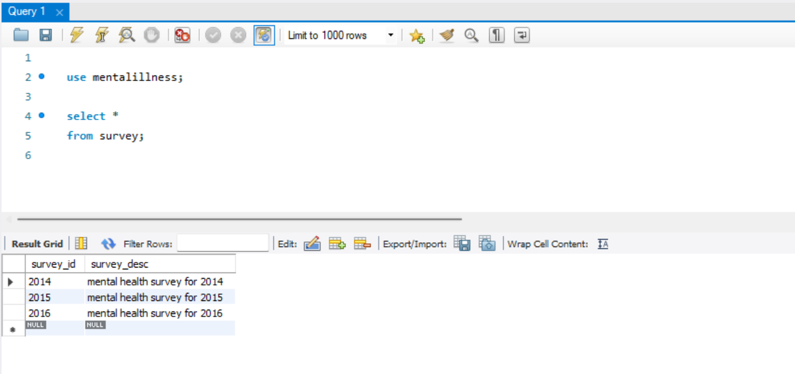

# mentalillness_survey_database

The process inculdes:

- I. Data Cleaning
    - *checking spelling*
    - *grouping the same categories*
    - *dropping unnecessary columns*
    - *filling 'NaN'*

- II. Data Preparation
    - *preparing the data for inserting into the tables*

- III. Creating Database

#### MySQL database contains 3 tables:
##### 1. survey table
- *survey_id (primary key)*
- *survey_desc*

##### 2. question table
- *question_id (primary key)*
- *question_text*
- *question_type (categorized by my own for further analysis)*

##### 3. answer table
- *answer_id (primary key)*
- *answer_text*
- *survey_id (foreign key)*
- *question_id (foreign key)*

Link to resource and inspiration: https://www.kaggle.com/datasets/anth7310/mental-health-in-the-tech-industry

Tutorial Guide: https://www.youtube.com/watch?v=4C7vFFyyZjE&t=932s
